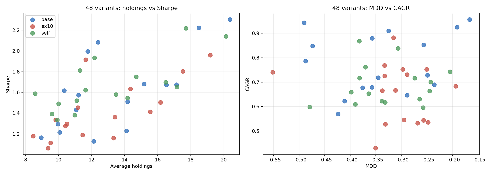
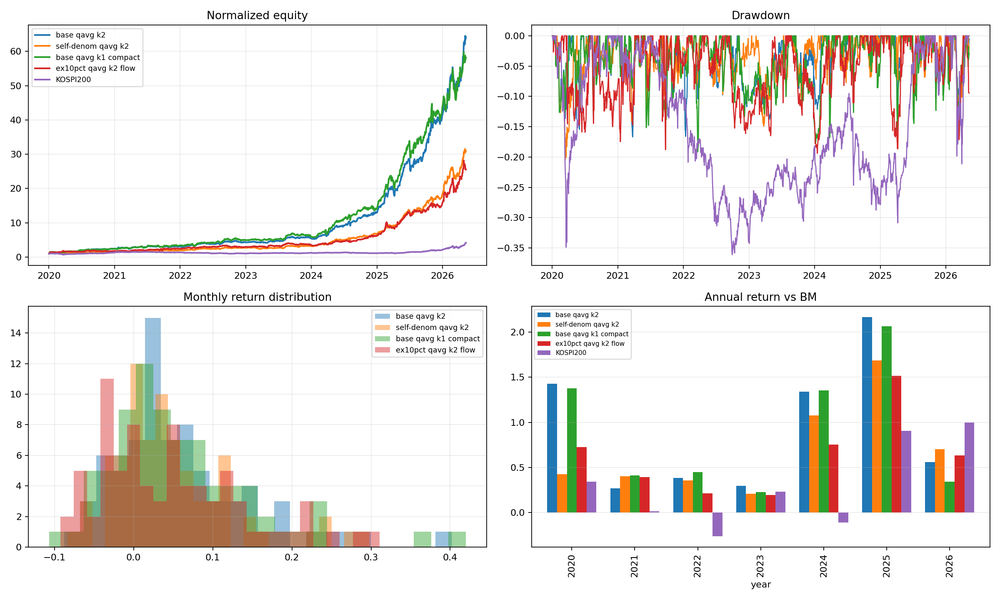
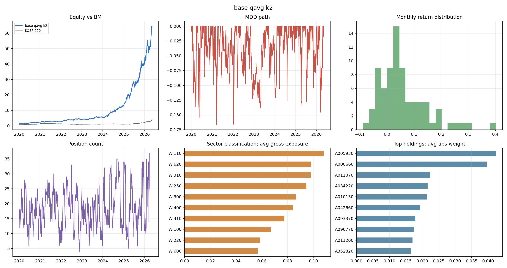
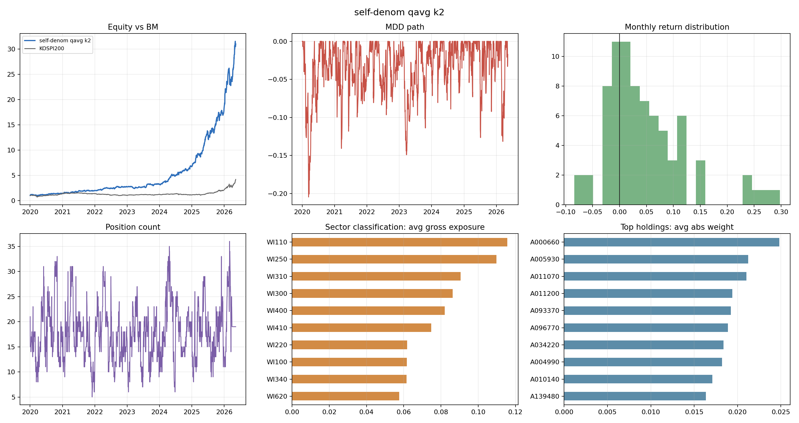
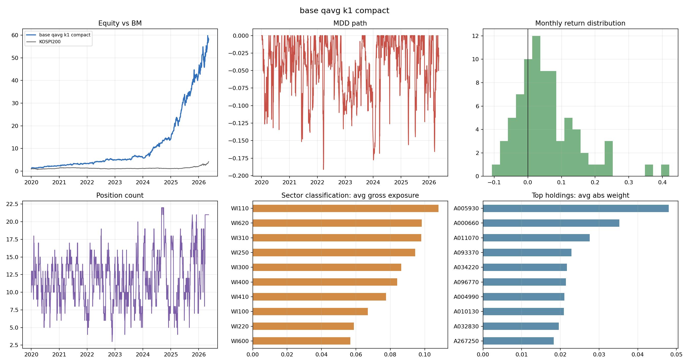
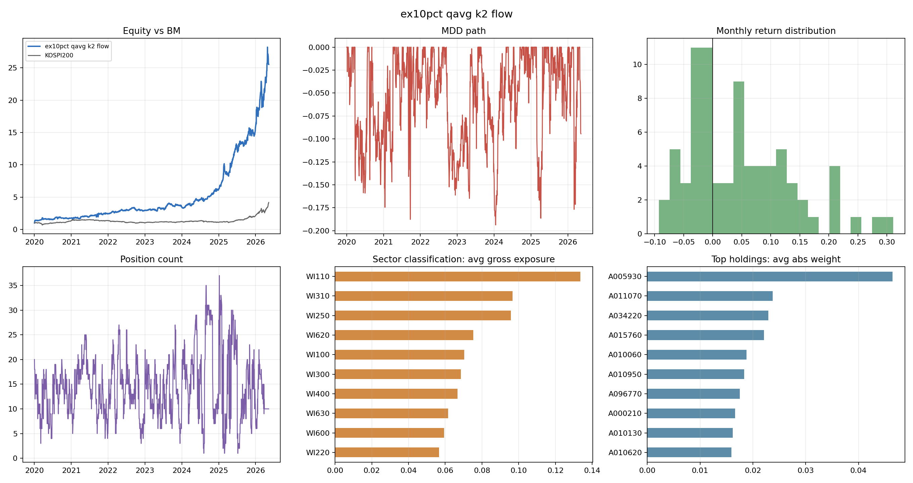

# RRG OP RRG 48-variant backtest review

## Scope

- Test window: 2020-01-01 to 2026-05-11.
- Universe/sector: KOSPI200 with WI26 big sector classification.
- Execution: weekly target generation, next-open fills, 2bp fee, 15bp sell tax, 5bp slippage, long gross 1.0 and short gross 0.5.
- Variant count: 48 conceptual alternatives, not a parameter search.
- OP RRG modes: `base` uses sector OP share of total market OP, `ex10` excludes every stock with BM weight greater than 10% from both sector and market OP, `self` compares sector OP to its own history.

## Selection

| strategy_id | op_rrg_mode | stock_score | compression | confirm | cagr | mdd | sharpe | monthly_win_rate | monthly_bm_win_rate | avg_total_count | selection_reason |
| --- | --- | --- | --- | --- | --- | --- | --- | --- | --- | --- | --- |
| rrg_op_rrg_grid_base_qavg_k2_none | base | qavg | k2 | none | 95.62% | -16.68% | 2.223 | 75.32% | 63.64% | 18.487 | Best qavg core: highest CAGR with shallowest MDD among high-Sharpe core variants. |
| rrg_op_rrg_grid_self_qavg_k2_none | self | qavg | k2 | none | 74.28% | -20.47% | 2.220 | 75.32% | 58.44% | 17.701 | Alternative OP denominator: checks if sector OP should be compared to its own history rather than market OP share. |
| rrg_op_rrg_grid_base_qavg_k1_none | base | qavg | k1 | none | 92.51% | -19.13% | 1.996 | 74.03% | 62.34% | 11.771 | Compact core: cuts average holdings to about 12 while preserving MDD near -20%. |
| rrg_op_rrg_grid_ex10_qavg_k2_flow | ex10 | qavg | k2 | flow | 68.32% | -19.38% | 1.635 | 58.44% | 54.55% | 14.358 | Ex10pct diagnostic: best risk-controlled high-index-weight exclusion case. |

## Top 12 By Sharpe

| strategy_id | cagr | mdd | sharpe | monthly_bm_win_rate | avg_total_count | avg_turnover |
| --- | --- | --- | --- | --- | --- | --- |
| rrg_op_rrg_grid_base_op12_k2_none | 85.26% | -25.61% | 2.303 | 66.23% | 20.368 | 25.65% |
| rrg_op_rrg_grid_base_qavg_k2_none | 95.62% | -16.68% | 2.223 | 63.64% | 18.487 | 26.31% |
| rrg_op_rrg_grid_self_qavg_k2_none | 74.28% | -20.47% | 2.220 | 58.44% | 17.701 | 26.54% |
| rrg_op_rrg_grid_self_op12_k2_none | 71.69% | -27.41% | 2.140 | 62.34% | 20.129 | 25.66% |
| rrg_op_rrg_grid_base_op12_k1_none | 90.97% | -32.50% | 2.083 | 59.74% | 12.391 | 26.01% |
| rrg_op_rrg_grid_base_qavg_k1_none | 92.51% | -19.13% | 1.996 | 62.34% | 11.771 | 26.55% |
| rrg_op_rrg_grid_ex10_op12_k2_none | 73.06% | -28.87% | 1.959 | 62.34% | 19.175 | 26.68% |
| rrg_op_rrg_grid_self_op12_k1_none | 83.80% | -30.66% | 1.934 | 61.04% | 12.177 | 25.91% |
| rrg_op_rrg_grid_ex10_op12_k1_none | 88.22% | -31.57% | 1.914 | 63.64% | 11.652 | 27.11% |
| rrg_op_rrg_grid_self_qavg_k1_none | 70.08% | -24.24% | 1.811 | 59.74% | 11.301 | 26.71% |
| rrg_op_rrg_grid_ex10_qavg_k2_none | 75.27% | -29.73% | 1.804 | 63.64% | 17.517 | 27.37% |
| rrg_op_rrg_grid_self_qavg_k2_flow | 63.07% | -26.43% | 1.749 | 55.84% | 14.698 | 31.33% |

## Ex10pct Diagnostic

Excluding all BM-weight-above-10% names did not improve the main qavg path. The best risk-controlled ex10pct case was `ex10_qavg_k2_flow`, but it gave up a large amount of CAGR and Sharpe versus `base_qavg_k2_none`. This points to high-index-weight OP being informative rather than merely contaminating the market OP denominator.

| strategy_id | cagr | mdd | sharpe | monthly_bm_win_rate | avg_total_count | avg_turnover |
| --- | --- | --- | --- | --- | --- | --- |
| rrg_op_rrg_grid_ex10_op12_k2_none | 73.06% | -28.87% | 1.959 | 62.34% | 19.175 | 26.68% |
| rrg_op_rrg_grid_ex10_op12_k1_none | 88.22% | -31.57% | 1.914 | 63.64% | 11.652 | 27.11% |
| rrg_op_rrg_grid_ex10_qavg_k2_none | 75.27% | -29.73% | 1.804 | 63.64% | 17.517 | 27.37% |
| rrg_op_rrg_grid_ex10_qavg_k2_flow | 68.32% | -19.38% | 1.635 | 54.55% | 14.358 | 31.20% |
| rrg_op_rrg_grid_ex10_op12_k2_flow | 54.37% | -25.69% | 1.503 | 51.95% | 16.171 | 30.50% |
| rrg_op_rrg_grid_ex10_qavg_k1_none | 66.63% | -31.16% | 1.454 | 50.65% | 11.170 | 27.39% |

## Selected Stats Vs BM

| strategy | cagr | mdd | sharpe | calmar | monthly_win_rate | monthly_bm_win_rate | avg_total_count |
| --- | --- | --- | --- | --- | --- | --- | --- |
| base qavg k2 | 95.62% | -16.68% | 2.223 | 5.734 | 75.32% | 63.64% | 18.761 |
| self-denom qavg k2 | 74.28% | -20.47% | 2.220 | 3.629 | 75.32% | 58.44% | 17.704 |
| base qavg k1 compact | 92.51% | -19.13% | 1.996 | 4.836 | 74.03% | 62.34% | 11.904 |
| ex10pct qavg k2 flow | 68.32% | -19.38% | 1.635 | 3.525 | 58.44% | 54.55% | 14.238 |
| KOSPI200 | 25.97% | -36.11% | 1.056 | 0.719 | 55.84% |  | nan |

## Annual Return

2026 is YTD through 2026-05-11, not a full-year return.

| year | base qavg k2 | base qavg k2_excess_vs_bm | self-denom qavg k2 | self-denom qavg k2_excess_vs_bm | base qavg k1 compact | base qavg k1 compact_excess_vs_bm | ex10pct qavg k2 flow | ex10pct qavg k2 flow_excess_vs_bm | KOSPI200 |
| --- | --- | --- | --- | --- | --- | --- | --- | --- | --- |
| 2020 | 142.68% | 108.61% | 42.61% | 8.53% | 137.53% | 103.45% | 72.51% | 38.43% | 34.08% |
| 2021 | 26.72% | 25.46% | 40.34% | 39.08% | 41.31% | 40.05% | 39.25% | 37.99% | 1.26% |
| 2022 | 38.27% | 64.42% | 35.39% | 61.54% | 44.83% | 70.98% | 21.32% | 47.48% | -26.15% |
| 2023 | 29.51% | 6.54% | 20.80% | -2.18% | 22.45% | -0.52% | 19.48% | -3.50% | 22.98% |
| 2024 | 134.01% | 145.23% | 107.57% | 118.79% | 135.34% | 146.56% | 75.33% | 86.55% | -11.22% |
| 2025 | 216.46% | 125.79% | 168.42% | 77.75% | 206.35% | 115.68% | 151.38% | 60.71% | 90.67% |
| 2026 | 55.71% | -44.20% | 70.43% | -29.49% | 34.02% | -65.90% | 63.32% | -36.60% | 99.91% |

## Plots

